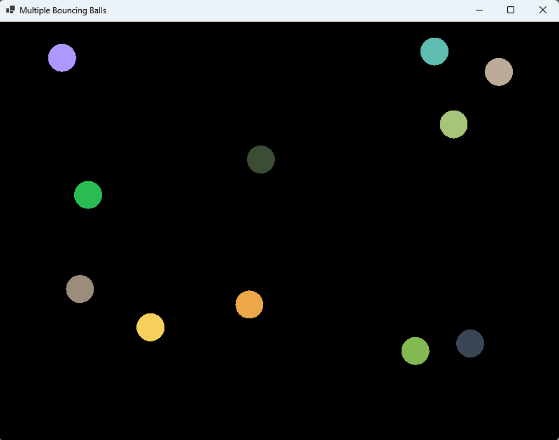

## Tutorial: Membuat Simulasi Bola Memantul dengan Windows Forms di C#

### Tujuan

Mempelajari cara membuat simulasi bola yang memantul di dalam area menggunakan **Windows Forms** di C#. Langkah-langkah meliputi:
1. Membuat area simulasi.
2. Menambahkan bola statis dan animasi.
3. Menambahkan logika tabrakan dengan dinding dan bola lainnya.
4. Menambahkan interaktivitas melalui klik mouse.



---

### Lingkungan Pengembangan
1. Platform: .NET 6.0
2. Bahasa: C# 10
3. IDE: Visual Studio 2022

---

### Pemodelan Objek

### **Kelas `BallPanel`**
#### **Deskripsi**
- `BallPanel` adalah kelas yang mewarisi `Panel`.
- Berfungsi sebagai area utama untuk simulasi bola, termasuk menggambar bola dan area batas (`BallArea`).
- Menangani logika utama animasi dan interaksi seperti tabrakan bola, tabrakan dengan dinding, dan event klik mouse untuk menambahkan bola baru.

#### **Penggunaan**
- Membuat area visual tempat semua bola bergerak dan berinteraksi.
- Menangani event `OnPaint` untuk menggambar ulang semua bola dan area batas setiap frame.
- Mengelola animasi bola menggunakan loop animasi di metode `StartAnimation`.

### **Kelas `BallArea`**
#### **Deskripsi**
- `BallArea` adalah kelas untuk mendefinisikan batas area tempat bola bergerak.
- Memiliki properti seperti:
  - `MinX`, `MinY`: Batas kiri dan atas area.
  - `MaxX`, `MaxY`: Batas kanan dan bawah area.
- Menyediakan metode `Draw` untuk menggambar area batas dengan warna latar dan garis tepi.

#### **Penggunaan**
- Menentukan batas gerakan bola dalam `BallPanel`.
- Digunakan di logika tabrakan dinding dalam metode `CollideWithWalls` milik `Ball`.

### **Kelas `Ball`**
#### **Deskripsi**
- `Ball` adalah kelas untuk merepresentasikan sebuah bola dalam simulasi.
- Memiliki properti seperti:
  - **Posisi**: `X`, `Y` (koordinat bola di panel).
  - **Kecepatan**: `SpeedX`, `SpeedY` (mengatur arah dan kecepatan bola).
  - **Radius**: Menentukan ukuran bola.
  - **Warna**: Warna unik untuk setiap bola.
- Menyediakan metode:
  - `Draw`: Menggambar bola menggunakan koordinat, radius, dan warna.
  - `CollideWithWalls`: Mengatur logika tabrakan bola dengan batas area.
  - `CollideWithBall`: Mengatur logika tabrakan antar bola.

#### **Penggunaan**
- Merepresentasikan setiap bola dalam simulasi.
- Digunakan oleh `BallPanel` untuk menggambar, menggerakkan, dan menangani tabrakan bola.

---

### **Kelas `Program`**
#### **Deskripsi**
- `Program` adalah kelas utama yang menjalankan aplikasi.
- Memuat form utama yang berisi `BallPanel`.

#### **Penggunaan**
- Menjalankan aplikasi Windows Forms menggunakan metode `Main`.
- Menginstansiasi `BallPanel` dan menambahkannya ke dalam `Form`.

---

### **Cara Kerja dan Hubungan Antar Kelas**

1. **`Program`**:
   - Menjalankan aplikasi dan menampilkan form utama dengan `BallPanel`.

2. **`BallPanel`**:
   - Membuat dan menggambar batas area (`BallArea`) serta semua bola (`Ball`).
   - Mengelola loop animasi bola:
     - Memperbarui posisi bola berdasarkan kecepatan.
     - Memeriksa dan menangani tabrakan bola dengan dinding (`BallArea`) dan bola lainnya.
   - Menangani event klik mouse untuk menambahkan bola baru.

   - **Loop Animasi (`StartAnimation`)**:
     - Terletak di `BallPanel`.
     - Menggunakan `Task` dan `Task.Delay` untuk memperbarui posisi bola dan menggambar ulang setiap frame (30 fps).

   - **Event Mouse Click**:
     - Ditangani oleh `BallPanel`.
     - Menambahkan bola baru dengan koordinat awal sesuai lokasi klik.

3. **`BallArea`**:
   - Digunakan oleh `BallPanel` untuk menentukan batas gerakan bola.

4. **`Ball`**:
   - Digunakan oleh `BallPanel` untuk menggambar, menggerakkan, dan menangani tabrakan bola.
   - **Tabrakan Antar Bola**:
     - Setiap bola memeriksa jaraknya dengan bola lain.
     - Jika bola bertabrakan, kecepatan (arah) kedua bola diubah untuk mensimulasikan pantulan.

---

### Langkah-langkah

### **1. Membuat `BallPanel` Kosong**

1. **Deskripsi**: Membuat panel kosong sebagai area simulasi bola.
2. **Implementasi**:
   - Buat kelas `BallPanel` yang mewarisi `Panel`.
   - Atur properti dasar, seperti ukuran dan warna latar.

**Kode untuk `BallPanel.cs`:**

```csharp
using System.Drawing;
using System.Windows.Forms;

namespace BouncingBall
{
    public class BallPanel : Panel
    {
        public BallPanel(int width, int height)
        {
            DoubleBuffered = true;
            Size = new Size(width, height);
            BackColor = Color.Black; // Warna latar belakang
        }
    }
}
```

**Kode untuk `Program.cs`:**

```csharp
using System;
using System.Windows.Forms;

namespace BouncingBall
{
    internal static class Program
    {
        [STAThread]
        static void Main()
        {
            Application.EnableVisualStyles();
            Application.SetCompatibleTextRenderingDefault(false);

            var form = new Form
            {
                Text = "Bouncing Balls Simulation",
                ClientSize = new Size(800, 600)
            };

            var ballPanel = new BallPanel(800, 600);
            form.Controls.Add(ballPanel);

            Application.Run(form);
        }
    }
}
```

**Jalankan aplikasi**:
- Sebuah jendela kosong dengan latar belakang hitam akan muncul.

---

### **2. Membuat `BallArea` dan Memasangkan ke `BallPanel`**

1. **Deskripsi**: Membuat area yang membatasi gerakan bola.
2. **Implementasi**:
   - Tambahkan kelas `BallArea`.
   - Tampilkan `BallArea` di dalam `BallPanel`.

**Kode untuk `BallArea.cs`:**

```csharp
using System.Drawing;

namespace BouncingBall
{
    public class BallArea
    {
        public int MinX { get; }
        public int MinY { get; }
        public int MaxX { get; }
        public int MaxY { get; }
        private readonly Color _fillColor;
        private readonly Color _borderColor;

        public BallArea(int x, int y, int width, int height, Color fillColor, Color borderColor)
        {
            MinX = x;
            MinY = y;
            MaxX = x + width;
            MaxY = y + height;
            _fillColor = fillColor;
            _borderColor = borderColor;
        }

        public void Draw(Graphics g)
        {
            using var fillBrush = new SolidBrush(_fillColor);
            g.FillRectangle(fillBrush, MinX, MinY, MaxX - MinX, MaxY - MinY);
            using var pen = new Pen(_borderColor);
            g.DrawRectangle(pen, MinX, MinY, MaxX - MinX, MaxY - MinY);
        }
    }
}
```

**Memperbarui `BallPanel.cs`:**

Tambahkan logika untuk menggambar `BallArea`.

```csharp

// ... kode sebelumnya ...

private readonly BallArea _area;

public BallPanel(int width, int height) : base()
{

    // ... kode sebelumnya ...

    _area = new BallArea(0, 0, width, height, Color.Black, Color.White);
}

protected override void OnPaint(PaintEventArgs e)
{
    base.OnPaint(e);
    _area.Draw(e.Graphics);
}
```

**Jalankan aplikasi**:
- Area berwarna hitam dengan batas putih akan muncul di dalam panel.

---

### **3. Membuat `Ball` dan Menampilkan Bola Statis**

1. **Deskripsi**: Menambahkan satu bola statis ke dalam `BallPanel`.
2. **Implementasi**:
   - Tambahkan kelas `Ball`.
   - Gambar bola di dalam `BallPanel`.

**Kode untuk `Ball.cs`:**

```csharp
using System.Drawing;

namespace BouncingBall
{
    public class Ball
    {
        public float X { get; set; }
        public float Y { get; set; }
        public float Radius { get; }
        private readonly Color _color;

        public Ball(float x, float y, float radius, Color color)
        {
            X = x;
            Y = y;
            Radius = radius;
            _color = color;
        }

        public void Draw(Graphics g)
        {
            using var brush = new SolidBrush(_color);
            g.FillEllipse(brush, X - Radius, Y - Radius, Radius * 2, Radius * 2);
        }
    }
}
```

**Memperbarui `BallPanel.cs`:**

Tambahkan bola statis.

```csharp

// ... kode sebelumnya ...

private readonly List<Ball> _balls = new();

public BallPanel(int width, int height) : base()
{
    // ... kode sebelumnya ...

    _balls.Add(new Ball(200, 200, 20, Color.Red));
}

protected override void OnPaint(PaintEventArgs e)
{
    base.OnPaint(e);
    _area.Draw(e.Graphics);

    foreach (var ball in _balls)
    {
        ball.Draw(e.Graphics);
    }
}
```

**Jalankan aplikasi**:
- Bola merah akan muncul di dalam area.

---

### **4. Membuat Bola Bergerak dan Bertabrakan dengan Dinding**

1. **Deskripsi**: Menambahkan logika untuk membuat bola bergerak dan memantul saat bertabrakan dengan dinding.
2. **Implementasi**:
   - Tambahkan properti kecepatan pada `Ball`.
   - Tambahkan logika pergerakan dan tabrakan di `BallPanel`.

**Memperbarui `Ball.cs`:**

Tambahkan properti kecepatan dan logika tabrakan dinding.

```csharp

// ... kode sebelumnya ...

public float SpeedX { get; set; }
public float SpeedY { get; set; }

public void CollideWithWalls(BallArea area)
{
    if (X - Radius < area.MinX || X + Radius > area.MaxX)
    {
        SpeedX = -SpeedX;
    }

    if (Y - Radius < area.MinY || Y + Radius > area.MaxY)
    {
        SpeedY = -SpeedY;
    }
}
```

**Memperbarui `BallPanel.cs`:**

Tambahkan logika animasi.

```csharp

// ... kode sebelumnya ...

private async Task StartAnimation()
{
    while (true)
    {
        foreach (var ball in _balls)
        {
            ball.CollideWithWalls(_area);
            ball.X += ball.SpeedX;
            ball.Y += ball.SpeedY;
        }

        Invalidate();
        await Task.Delay(30);
    }
}
```

Tambahkan bola bergerak dan mulai animasi.

```csharp

public BallPanel(int width, int height)
{
    // .. kode sebelumnya ...

    _balls.Add(new Ball(100, 100, 20, Color.Blue) { SpeedX = 5, SpeedY = 3 });

    Task.Run(() => StartAnimation());
}

```

**Jalankan aplikasi**:
- Bola akan bergerak dan memantul di dinding.

---

### **5. Membuat Bola Bisa Bertabrakan dengan Bola Lainnya**

1. **Deskripsi**: Tambahkan logika tabrakan antar bola.
2. **Implementasi**:
   - Tambahkan metode `CollideWithBall` di `Ball`.

**Memperbarui `Ball.cs`:**

Tambahkan logika tabrakan antar bola.

```csharp

// .. kode sebelumnya ...

public void CollideWithBall(Ball other)
{
    var dx = other.X - X;
    var dy = other.Y - Y;
    var distance = Math.Sqrt(dx * dx + dy * dy);

    if (distance < Radius + other.Radius)
    {
        SpeedX = -SpeedX;
        SpeedY = -SpeedY;

        other.SpeedX = -other.SpeedX;
        other.SpeedY = -other.SpeedY;
    }
}
```

**Memperbarui `BallPanel.cs`:**

Tambahkan logika tabrakan antar bola di metode `StartAnimation`.

```csharp

private async Task StartAnimation()
{
    while (true)
    {
        foreach (var ball in _balls)
        {
            ball.CollideWithWalls(_area);
            ball.X += ball.SpeedX;
            ball.Y += ball.SpeedY;
        }

        for (int i = 0; i < _balls.Count; i++)
        {
            for (int j = i + 1; j < _balls.Count; j++)
            {
                _balls[i].CollideWithBall(_balls[j]);
            }
        }

        Invalidate();
        await Task.Delay(30);
    }
}
```

**Jalankan aplikasi**:
- Bola akan saling bertabrakan.

---

### **6. Menambahkan Mouse Click Event**

1. **Deskripsi**: Tambahkan fitur untuk menambah bola baru dengan klik mouse.
2. **Implementasi**:
   - Tambahkan event handler untuk klik mouse.

**Memperbarui konstruktor `Ball.cs`:**

```csharp

public Ball(float x, float y, float radius, float speed, float angleInDegree, Color color)
{
    X = x;
    Y = y;
    Radius = radius;
    _color = color;
    SpeedX = (float)(speed * Math.Cos(Math.PI * angleInDegree / 180));
    SpeedY = (float)(-speed * Math.Sin(Math.PI * angleInDegree / 180));
}

```

**Memperbarui `BallPanel.cs`:**

```csharp

public BallPanel(int width, int height)
{
    DoubleBuffered = true;
    Size = new Size(width, height);
    BackColor = Color.Black; // Warna latar belakang

    _area = new BallArea(0, 0, width, height, Color.Black, Color.White);

    MouseClick += (s, e) =>
    {
        var radius = 20;
        var speed = 5;
        var angle = _random.Next(360);
        var newBall = new Ball(e.X, e.Y, radius, speed, angle, Color.FromArgb(_random.Next(256), _random.Next(256), _random.Next(256)));
        _balls.Add(newBall);
    };

    Task.Run(() => StartAnimation());
}

```

**Jalankan aplikasi**:
- Klik di area untuk menambahkan bola baru.

---

### **7. Menguji Coba**

1. Jalankan aplikasi.
2. Klik mouse untuk menambahkan bola.
3. Amati bola yang memantul di dalam area.
4. Amati bagaimana bola bertabrakan dengan dinding dan bola lainnya.